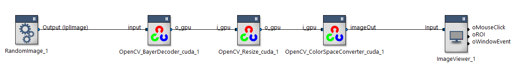
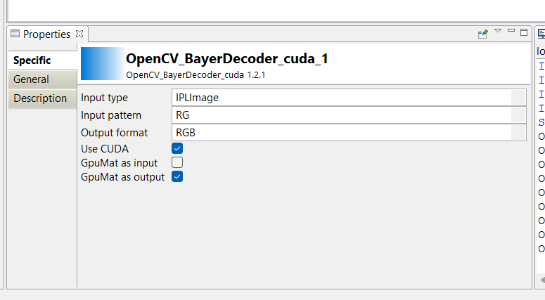
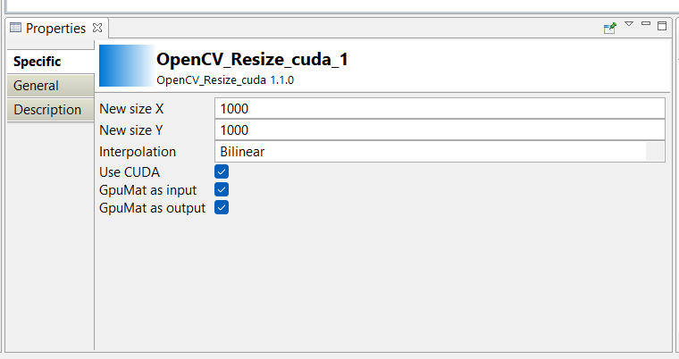
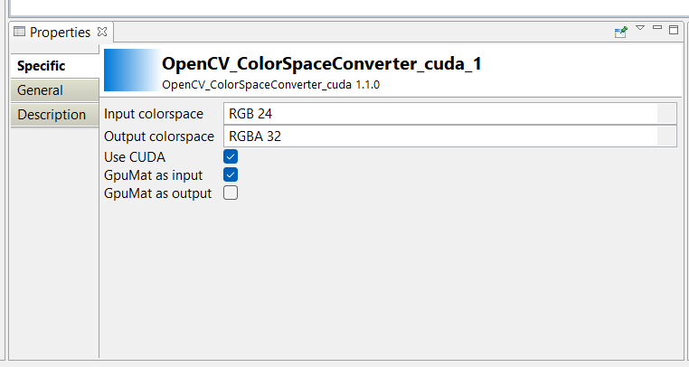

# Introduction

This repository contains a RTMaps package that uses OpenCV with CUDA in order to perform GPU processing on images. This package is inspired by this RTMaps [repo](https://github.com/Intempora/rtmaps-cuda-examples) explaining how to use GPU-accelerated computing with RTMaps components.

More specifically, this sample illustrates exchanging CUDA objects on the inputs and outputs of RTMaps components without having to transfer them to main memory. The following minimal example illustrates the point:



The first component "OpenCV_BayerDecoder_cuda_1" will have these properties:


"Use CUDA" enabled and "GPUMat as output" enabled, in order to accept "CPU" memory in input, download the data in GPU memory, do the processing and transfer the GPU memory to the next component, "OpenCV_Resize_cuda_1" with these properties:


"Use CUDA" enabled, "GPUMat as output" enabled and "GPUMat as input" enabled, in order to accept "GPU" memory in input, do the processing and transfer the GPU memory to the next component, "OpenCV_ColorSpaceConverter_cuda_1" with these properties:


"Use CUDA" enabled, and "GPUMat as input" enabled, in order to accept "GPU" memory in input, do the processing and transfer the GPU data to CPU memory in order to display the result.

## Requirements

* CMake >= 3.0
* Linux: GCC or Clang
* Windows: Visual C++ Compiler >= 2015
* OpenCV >= 4.10.0
* CUDA >= 12.6
* RTMaps >= 4.10

## CUDA

Install CUDA 12.6 from this link https://developer.nvidia.com/cuda-12-6-0-download-archive following the desired "Operating system" and "Architecture".

## OpenCV

This RTMaps package uses the OpenCV library version 4.10. You can download pre-built binaries or download the sources and build them. Both binaries and sources are available from https://opencv.org/releases/ --please select a version 4.10.0 or greater.

### Pre-built binaries

Keep in mind that, as OpenCV 4 is a C++ library with a C++ interface, the compiler used to build OpenCV has to match the compiler you use to build your RTMaps component. "Windows" downloads on the OpenCV download page contain binaries built for versions of Microsoft Visual C++ (Visual Studio). For example, the string "vc14_vc15" in the file name means that it contains binaries for Visual Studio 2015 and 2017. It will not work with any other version.

In Ubuntu, installing OpenCV with the system's packet manager should also work.

### Build from source for ubuntu

```
wget -O opencv.zip https://github.com/opencv/opencv/archive/4.10.0.zip
unzip opencv.zip

wget -O opencv_contrib.zip https://github.com/opencv/opencv_contrib/archive/refs/tags/4.10.0.zip
unzip opencv_contrib.zip

mkdir opencv
cd opencv-4.10.0
mkdir build
cd build
cmake -G "Unix Makefiles" -DCMAKE_BUILD_TYPE=RELEASE -DBUILD_DOCS=OFF -DBUILD_EXAMPLES=OFF -DBUILD_NEW_PYTHON_SUPPORT=OFF -DBUILD_SHARED_LIBS=OFF -DBUILD_TESTS=OFF -DBUILD_WITH_DEBUG_INFO=OFF \
 -DWITH_PNG=OFF -DWITH_JPEG=OFF -DWITH_CUDA=ON -DWITH_EIGEN=OFF -DWITH_GTK=OFF -DWITH_OPENEXR=OFF -DWITH_PVAPI=OFF -DWITH_PYTHON=OFF -DWITH_TIFF=OFF -DWITH_1394=OFF -DWITH_V4L=OFF -DWITH_UNICAP=OFF \
 -DWITH_GSTREAMER=OFF -DWITH_FFMPEG=OFF -DWITH_JASPER=OFF -DCMAKE_POSITION_INDEPENDENT_CODE=ON -DOPENCV_EXTRA_MODULES_PATH=../../opencv_contrib-4.10.0/modules -DCMAKE_INSTALL_PREFIX=../../opencv \
 -DBUILD_opencv_java:BOOL=OFF -DBUILD_opencv_java_bindings_generator:BOOL=OFF -DBUILD_opencv_js_bindings_generator:BOOL=OFF -DBUILD_opencv_objc_bindings_generator:BOOL=OFF \
 -DBUILD_opencv_python3:BOOL=OFF -DBUILD_opencv_python_bindings_generator:BOOL=OFF -DBUILD_opencv_python_tests:BOOL=OFF ..
make -j4
make install

```

## Build the package

```
cmake .. -D"RTMAPS_SDKDIR=rtmaps_install_dir" -DCMAKE_BUILD_TYPE=Release -DOPENCV_PATH=opencv_install_dir -DUSE_OPENCV_STATIC=OFF
cmake --build . --config Release --target rtmaps_image_processing_opencv_cuda

```
- OPENCV_PATH is used to specify the installation dir of opencv.
- USE_OPENCV_STATIC indicate if opencv library is of type static or shared.

`Note` that on Windows once compiled successfully, you must copy the bin/ folder of the openCV libraries next to the .pck, otherwise you will not be able to load the package into RTMaps. In that case, you will have the `DLL missing` message in the console, showing your dependencies problem.
The structure should be as following:
            
```
packages
└───debug/    
│   └───rtmaps_image_processing_opencv_cuda.pck
│   └───bin/
│       │   opencv_core410.dll
│       │   opencv_imgproc410.dll
│       │   [...]
```


